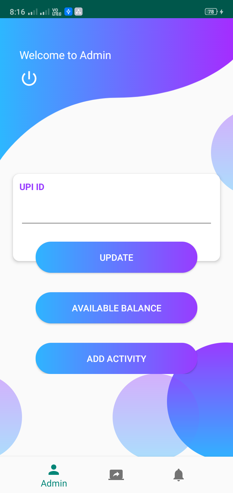
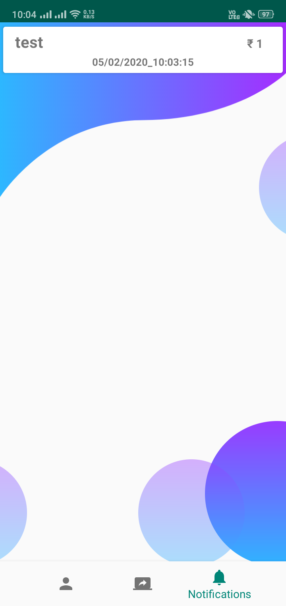
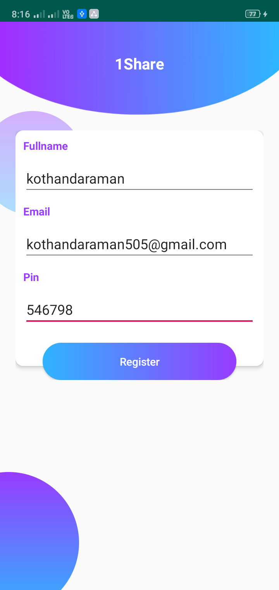
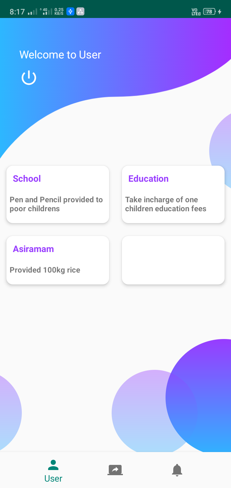

# ONE SHARE (Android Application)
# Motto : “SHARING FOR CARING”

“Give your TIME & MONEY we will help you ensure that it is spent MORE MEANINGFULLY!.” The ONE SHARE application is used for the public to donate some amount for the people who in need. With the project, the displaced flood or any other problem victims as well as the entire community will definitely be transformed directly and indirectly considering the benefits that it would create such as improvement on accessibility on basic services (temporary shelter, health, nutrition, food, clothing, domestic items). 

The Main objectives of this project are:
1.	Main focus of OneShare is educating poor children and medical help for who needed.
2.	When disaster immediatly recover the situation is more import so the fund will use to that situation.
3.	To reduce the stress of collecting amount directly from the people.

# Sample Screenshot

   
   
   
   
   
